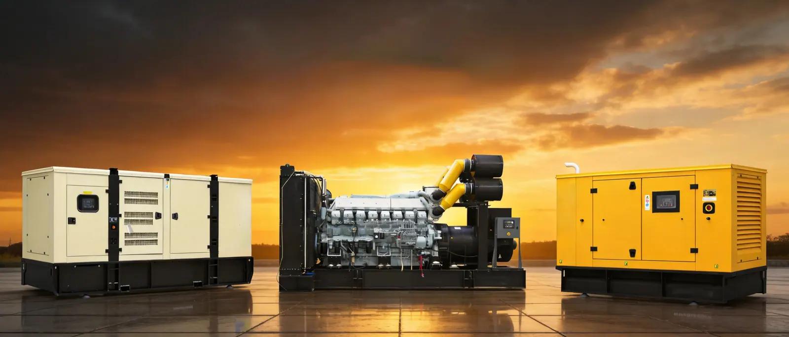

# ALEO POWER Performance Optimization Notes

## Implemented

- Generated responsive WebP and AVIF image variants for logo, founder photo, hero generator image, and factory proof images.
- Replaced image tags with `<picture>` using AVIF first, WebP fallback, responsive `srcset`, `sizes`, explicit `width` and `height`, `decoding="async"`, and lazy loading for non-critical images.
- Added critical CSS inline in HTML heads and changed the main stylesheet to preload with `onload` activation plus a `<noscript>` fallback.
- Added hero image preload for pages using the hero background.
- Added logo preload for pages using the logo.
- Added `defer` to shared `app.js`.
- Updated CSS hero background to use `image-set()` with AVIF/WebP.
- Added `font-display: swap` through a local Inter font-face declaration.
- Added stable image aspect ratios for logo, product media, founder image, footer logo, and About proof gallery.
- Added `vercel.json` cache headers for long-lived static assets and short-lived HTML, sitemap, and robots files.

## Key Code Snippets

### Responsive Image Pattern

```html
<picture>
  <source
    type="image/avif"
    srcset="./assets/home-hero-generator-800.avif 800w, ./assets/home-hero-generator-1600.avif 1600w"
    sizes="(max-width: 760px) 92vw, 380px">
  <source
    type="image/webp"
    srcset="./assets/home-hero-generator-800.webp 800w, ./assets/home-hero-generator-1600.webp 1600w"
    sizes="(max-width: 760px) 92vw, 380px">
  
</picture>
```

### Critical CSS And Deferred Stylesheet

```html
<style data-critical-css>
body{margin:0;font-family:Inter,Arial,Helvetica,sans-serif}.site-header{position:sticky;top:0}.hero{background:#111;color:#fff}
</style>
<link rel="preload" href="./styles.css" as="style" onload="this.onload=null;this.rel='stylesheet'">
<noscript><link rel="stylesheet" href="./styles.css"></noscript>
```

### Hero Preload

```html
<link
  rel="preload"
  as="image"
  href="./assets/home-hero-generator-1600.webp"
  imagesrcset="./assets/home-hero-generator-800.webp 800w, ./assets/home-hero-generator-1600.webp 1600w"
  imagesizes="100vw"
  fetchpriority="high">
```

### Vercel Cache Headers

```json
{
  "source": "/assets/(.*)",
  "headers": [
    {
      "key": "Cache-Control",
      "value": "public, max-age=31536000, immutable"
    }
  ]
}
```

## CDN And Cache Recommendations

- Keep all versioned image assets under `/assets/` and serve them with `Cache-Control: public, max-age=31536000, immutable`.
- Keep HTML pages short-cache or revalidated because product copy, SEO tags, and inquiry CTAs may change.
- Use Vercel Edge Network as the CDN layer for static files.
- Avoid replacing an existing image file with different content using the same filename after deployment. Prefer new filenames or regenerate the `-800`, `-1600`, `.webp`, and `.avif` variants.
- Keep `sitemap.xml` and `robots.txt` on a short cache such as 1 hour.

## Performance Report Checklist

- Run Lighthouse in Chrome DevTools on mobile and desktop.
- Test these pages first:
  - `/`
  - `/about/`
  - `/products/700kw-gas-generator-set/`
  - `/contact/`
- Target scores:
  - LCP under 2.5s
  - CLS under 0.1
  - INP under 200ms
  - Total Blocking Time under 200ms in lab tests
- In PageSpeed Insights, confirm:
  - Hero background image is loaded as WebP/AVIF.
  - Non-first-screen images are lazy loaded.
  - Main JS is deferred.
  - Static assets show long cache lifetimes after Vercel deployment.
